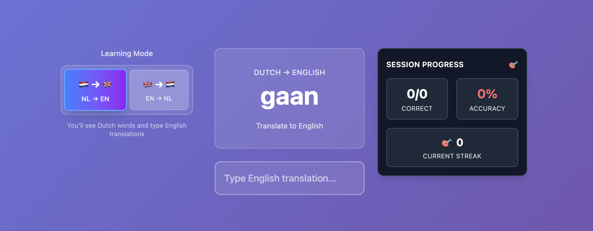

# 🇳🇱 Dutch Language Learning App

A modern, interactive web application for learning Dutch vocabulary with English translations. Built with React, TypeScript, and Tailwind CSS.



## ✨ Features

- 📚 **Interactive Vocabulary Learning**: Practice Dutch-English word pairs from CSV data
- 🔄 **Dual Learning Modes**: 
  - 🇳🇱 → 🇬🇧 Dutch to English translation
  - 🇬🇧 → 🇳🇱 English to Dutch translation
- 🧠 **Smart Fuzzy Matching**: Accepts minor typos and spelling variations
- 📊 **Progress Tracking**: Session statistics and all-time progress tracking
- 🔥 **Streak System**: Build and maintain learning streaks
- 💾 **Local Storage**: Your progress is saved automatically
- 📱 **Responsive Design**: Works perfectly on desktop, tablet, and mobile
- 🎨 **Modern UI**: Beautiful gradients, animations, and micro-interactions

## 🚀 Quick Start

### Prerequisites
- Node.js (v18 or higher)
- npm or yarn

### Installation

1. **Clone and install dependencies:**
   ```bash
   git clone <repository-url>
   cd fresher
   npm install
   ```

2. **Start development server:**
   ```bash
   npm run dev
   ```

3. **Open your browser:**
   Navigate to `http://localhost:5173`

### Build for Production

```bash
npm run build
npm run preview  # Preview the production build
```

## 🎯 How to Use

1. **Choose Learning Mode**: Select between Dutch→English or English→Dutch translation
2. **Read the Word**: A word will be displayed in the source language
3. **Type Translation**: Enter the translation in the target language
4. **Get Feedback**: Receive immediate feedback on your answer
5. **Track Progress**: Monitor your accuracy, streaks, and overall progress
6. **View Statistics**: Click the Stats button to see detailed progress metrics

## 🛠️ Tech Stack

- **Frontend**: React 18 + TypeScript
- **Styling**: Tailwind CSS with custom animations
- **Build Tool**: Vite
- **CSV Parsing**: Papa Parse
- **State Management**: React Hooks
- **Storage**: Browser LocalStorage

## 📁 Project Structure

```
src/
├── components/           # React components
│   ├── WordCard.tsx     # Displays the word to translate
│   ├── InputField.tsx   # Input field with feedback
│   ├── ModeToggle.tsx   # Language mode switcher
│   ├── ProgressIndicator.tsx  # Session progress display
│   └── StatsDashboard.tsx     # All-time statistics
├── utils/               # Utility functions
│   ├── csvParser.ts     # CSV data loading and parsing
│   ├── fuzzyMatch.ts    # Fuzzy string matching logic
│   ├── wordManager.ts   # Word selection and management
│   └── storage.ts       # LocalStorage utilities
├── types/               # TypeScript type definitions
│   └── index.ts
├── App.tsx             # Main application component
└── main.tsx            # Application entry point

public/
└── data/
    └── dutch_common_words.csv  # Vocabulary dataset
```

## 🎨 Features in Detail

### Fuzzy Matching
The app includes intelligent answer validation that:
- Ignores case sensitivity
- Accepts minor spelling mistakes (up to 2 character differences)
- Handles multiple correct answers (separated by `/` or `,`)
- Normalizes punctuation and whitespace

### Progress Tracking
- **Session Stats**: Current session accuracy and streak
- **All-Time Progress**: Total answers, words learned, best streak
- **Motivational Messages**: Encouraging feedback based on performance
- **Persistent Storage**: Progress saved between sessions

### User Experience
- **Smooth Animations**: Fade-ins, slide-ups, and hover effects
- **Keyboard Navigation**: Press Enter to submit answers
- **Visual Feedback**: Color-coded feedback for correct/incorrect answers
- **Responsive Layout**: Adapts to different screen sizes

## 📊 CSV Data Format

The vocabulary data should be in CSV format with the following structure:

```csv
Dutch,English
hond,dog
kat,cat
huis,house
auto,car
```

## 🎨 Customization

### Adding New Vocabulary
1. Edit `public/data/dutch_common_words.csv`
2. Follow the format: `Dutch,English`
3. Restart the development server

### Styling
- Modify `src/index.css` for global styles
- Update `tailwind.config.js` for custom colors and animations
- Edit component files for specific styling changes

## 🚀 Deployment

This app is ready for deployment on:
- **Netlify**: Drag and drop the `dist` folder
- **Vercel**: Connect your Git repository
- **GitHub Pages**: Use GitHub Actions for automatic deployment

## 📝 License

This project is open source and available under the MIT License.

## 🤝 Contributing

Contributions are welcome! Please feel free to submit a Pull Request.

---

**Happy Learning! 🎉 Veel succes met het leren van Nederlands! 🇳🇱**
